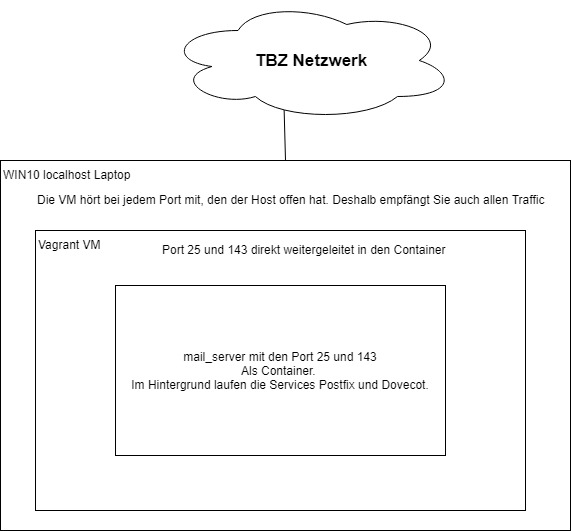

# Vorgaben von Herrn Berger
Diese Angaben wurden uns von Herrn Berger übergeben. Damit sind wir in der Lage eine VM zu starten, mit Docker schon installiert.

Wir haben uns aber anschliessend dazu entschieden die VM noch anzupassen. darum giltet die nachfolgende Beschreibung nur als Einfhrung, kann aber nicht 1 zu 1 für unsere Firma übernommen werde.
***
## Docker Testumgebung
    +---------------------------------------------------------------+
    ! Container-Engine: Docker                                      !
    +---------------------------------------------------------------+
    ! Gast OS: Ubuntu 16.04                                         !
    +---------------------------------------------------------------+
    ! Hypervisor: VirtualBox                                        !
    +---------------------------------------------------------------+
    ! Host-OS: Windows, MacOS, Linux                                !
    +---------------------------------------------------------------+
    ! Notebook - Schulnetz 10.x.x.x                                 !
    +---------------------------------------------------------------+
***
### Beschreibung

Einfache VM mit Docker installiert.

In der VM können folgende Beispiele ausprobiert werden:

* [apache - Apache Web Server](apache/)
* [db - MySQL Datenbank](mysql/)
* [apache4X - Scriptscript welches 4 Web Server Container erstellt](apache4X/)
* [compose - Docker Compose](compose/)
* [dotnet - .NET Entwicklungsumgebung](dotnet/)
* [jenkins - Build Umgebung](jenkins/)
* [microservice - Micro Service mit Node.js](microservice/)

Es muss einmalig die VM mit Docker erstellt und in die VM gewechselt werden:

	vagrant up
	vagrant ssh

Die Beispiele befinden sich, in der VM, im Verzeichnis `/vagrant`. Die Anwahl ist wie folgt:

	cd /vagrant/<Beispiel>

Die VM kann wie folgt verlassen heruntergefahren und gelöscht werden:

	exit
	vagrant halt
	vagrant destroy -f
***
Wir haben jedoch einige Änderungen vorgenommen, da wir den Port 25 nach aussen benötigen.
Daher werden wir ein eigenes Vagrantfile verweden und Herrn Berger übergeben.

# Technischer Beschrieb
Bei unserer Umgebung werden wwir einen Mail Server machen, welcher SMTP und IMAP Beherrscht. Da wir kein Zertifikat kaufen können, kann unser Mail Service nur mit sich selbst kommunizieren, da ansonsten alle Mail von Ihm verworfen werden.

Unser Mail Server setzt postfix ein, um die Mail zu transportieren, dies ist der sogennante MTA. Dovecot wird anschliessend dazu verwendet um per IMAP die Mails anzuzeigen. Dies wäre der MDA.

## Netzwerkplan
<br>
Für unser IP Konzept und Naming haben wir keine speziellen Forderungen gesetzt.
Wir haben direkt die IP die von Herr Berger definiert wurde auf unseren Ethernet Interfaces definiert.
Dadurch konnten wir immer einfach diret die korrekte IP bekommen.<br>
Denn im Moment verwenden wir unsere Interfaces in keinem andere Modul als diesem. Bei Nico wäre diese IP 10.71.13.18 bei Marco wäre diese IP Adresse 10.71.13.17.

## Weiterleitungen
Bei einer Anfrage auf den Port 143 empfängt unser localhost dei Anfrage und sendet dese an die VM, da wir ein Portforwarding definiert haben. Unsere VM empfängt die Anfragen und sendet diese Aufgrund einer docker Weiterleitung anschliessend an den Container weiter.

Dasselbe geschieht auch mit Port 25.

# Unseren Service benutzen
Hier ist eine kleine Anleitung um unsern Service zu starten. Inklusive der Installation auf dem Client.

## Voraussetzungen
Um unseren Service zu installieren, müssen folgende Dinge gegeben sein.
* vagrant muss installiert sein.
* Dieses Repository muss geklont sein.
* Unser Vagrantfile muss ausgeführt werden.

### vagrant installieren
Vagrant kann auf der folgende Webseite installiert werden.

[Vagrant Downloader und weitere Informationen](https://vagrantup.com)

### Repository klonen
Um unser Dockeerfile auszuführen, muss das Vagrantfile ausgeführt werden. Dazu muss aber zuerst das Repository geklont werden.

    git clone https://github.com/Euthal02/M300-Services/ marco_kaelin_lb2
    cd marco_kaelin_lb2


Diese Commands erstellen neu denOrdner marco_kaelin_lb2 und kopieren den Inhaltt meines LB2 Ordners auf Github hinein.

### vagrantfile ausführen
Das Vagrantfile muss anschliessend mit

    vagrant up

ausgeführt werden.

Dadurch werden die benötigten Packete automatisch erstellt.<br>
Anschliessend kann man per

    vagrant ssh

auf die VM zugreifen.

## Docker
Auf der VM ist Docker instaliert. Dieser Servvice ist dazu zuständig die Container und Images zu verwalten und zur Verfügung zu stellen. darin wird unser Service definiert.

Unser Service wird mit einem ***Dockerfile*** gestartet. ***docker-compose*** wird von uns nicht verwendet. Somit kann man mit nur einem file einen funktionierenden Server einrichten.

### Dockerfile
Unser Dockerfile kann man mit diesem Command ausführen.
Besser gesagt mit diesem Command wird ein Image erstellt, aus dieessem anschliessend ein Conainer erstellt werden kann.

    docker build /home/vagrant/sync/ -t mail_server

Dadurch wird nser Image erstellt. Dieses Image wird dann gebraucht, um unseren Container zu erstellen.
Aus unserem Dockerfile liest der Build Command alle wichige Infos raus und wandelt diese in das Image um. Unser Dockerfile ist sehr einfach aufgbeaut, mit verschiedenen Abschnitten, welche die verschiedenen Services dastellen.<br>

ZB. Ist jeder RUN Command ein eigener Service.<br>

Dies ermöglicht uns eine einfache und schnelle konfiguration welch übersichtlich ist und uns Aufschluss darüber verleit was genau beim ausführen des Dockerfiles geschieht.

Im Dockerfile können wir ausserdem auch ENV Variablen definieren, welche anschliessend vom System übernommen wwerden.

Dies erreichen wir per **ENV variable**

#### Abänderungen
Wir haben das Dockerfile drekt vom postfix Imgae übernommen und einige Änderungen vorgenommen. Am wichtigsten dazu war aber noch zu vermerken, dass der **s6 Service** installiert wird.

Der **s6 Service** sagte mir bis anhin nicht besonders viel. Anhand meiner Erfahrung erlaube ich mir aber die Annahme, dass dieser Service Konfigurationen erstellt.

Ich konnte mithilfe dieses Services erreichen, dass alle Services automatisch neu starten welche ich benötige.

### Ausführen
Mit diesem Command können wir aus unserem Image einen Container erstellen.

    docker run -d -p 25:25 -p 143:143 mail_server

Dorthin werden die Ports 25 und 143 geroutet. Es würden noch zwei Variablen benötigt werden, diese habe wir aber schon im Dockerfile mitgeben können. Dadurch erhalten wir eine kleineren Command der einfacher zu lesen ist.

## Client
**GANZ WICHTIG!!!**
Das Mail Programm von Windows 10 funktioniert mit diesem Service nicht, wir empfehlen den Thunderbird Mail Manager.

Auf dem Server sind momentan nur zwei Benutzer definiert.
Der Benutzer *blub* und der Benutzer *test*

| Namen        | Passwort      |
| :-------------:|:-------------:|
| blub     | asdf1234 |
| test     | asdf1234 |

Das Passwort wurde verhältnismässig schwach gewählt, da dies nur eine Testumgebung ist.

Ausserdem muss man seine hosts Datei folgendermassen anpassen:
````
localhost ganzedomain.ch
````

Man kann nun diese beiden Benutzer als E-Mail Konten auf dem Thunderbird Mail Client installieren.

Als Server kann jeweils der Name `ganzedomain.ch` verwendet werden. Die Port sind 25 und 143. Da unser Server keine Zertifikate unterstützt, empfehlen wir, die Sicherheitseinstellungen tief zu setzen. Also die Authentifizierungsmethode kann als `Passwort, ungesichert übertragen` definert werden. Bei der Verbindungssichereit kann `keine` ausgewäht werden.

Mit diesen Angaben kann man sich anschliessend auf den Service verbinden.

<br>
Wie erwähnt empfehlen wir den Thunderbird Mail Client zu benutzen, da dieser getestet ist und funktioniert.<br>
https://www.thunderbird.net/de/

Mit diesen Infos kann jeder seinen eigenen Mailserver aufsetzen. Und benutzen.

# Firewall
Wichtig ist, das auf dem lokalen Host die Firewall deaktiviert wird. Ansonsten verhindert diese die erfolgreiche Kommunikation zwischen dem Service und dem Client.

Auf der Vagrant VM oder dem Docker Container haben wir keine genaueren Firewal Konfigurationen vorgenommen, dort ist also alles geööffnet und von aussen erreichbar.

# Probleme
Wir hatten einige Probleme mit dem docker Container die wir mt dem Vagrantfile nicht hatten.

Zum Beispiel hatte das Logging nicht funktioniert, bis wir den Service syslogd installierten. Anschliessend konntne wir einen Service nichteinfach so neu starten, bis wir systemd installierten.

Bis jetzt haben wir Probleme, welche wir nicht lösen können

# Testfälle
Wir haben uns folgende Tests dazu überlegt. Diese Test wurden auch von uns direkt durchgeführt. Leider hatten wir keine Möglichkeit mehr an einer unabhängigen und nicht Technik versierten Person unseren Service zum testen zu geben.


| Namen  | Beschreibung      | Durchführer          | Wann | Soll | Ist | Grund |
| :-------------: | :-------------: | :-----: | :-----: | :-----: |  :-----: | :-----: |
| Server und Container erreichbar? | Zuerst testen wir, ob wir uns per SSH auf die VM einloggen können. Falls dies funktioniert, testen wir ob wir uns auf den Container einloggen können. Mittels `docker exec -it docker_id bash` | nkn | 05.04.2019 | Login funktioniert | Login funktioniert. | - |
| User testen | Da wir zwei seperate egenständige User erstellt haben, müssen wir testen ob diese fuktionieren. Wir versucen uns also mittels `su username` einzuloggen. Das Passwort ist bei allen gleich. `asdf1234` | mka | 05.04.2019 | Man kann sich in die User einloggen. | Man kann sich in die User einloggen. | - |
| Postfix Test | Wir testen zuerst einmal die lokale Übertragung des Postfix Servers. Dies gescheht mithilfe des installierten Packets mailx. Wir wissen mitlerweile schon, das die User funktionieren, also senden wir mit folgendem Command ein Mail dem User Test. `echo "Dies ist ein Test" &#124; mailx -s "Betreff" test@ganzedmain.ch` | mka | 12.04.2019 | Mail wird versendet und kommt an. | Mail wird versendet und kommt an. | - |
| Dovecot Test | Login mit einem Systemuser auf dem Thunderbird per IMAP. Passwort und Username bleiben gleich. | mka | 05.04.2019 | Login funktioniert. | Login funktioniert nicht. | Nach einem `tcpdump trace`, konnten wir herausfinden, weshab wir uns ncht einloggen können. Es kommen gar keine Pakete an. Nach einer langen Fehlersuche konnten wir anschliessend herausfinden, dass das Problem daher kommt, das die lokale Firewall noch allen Traffic blockiert. |
| Mails von extern versenden. | Wir wissen nun, dass man sich per Dovecot einloggen kann und das der Server intern Mails versenden kann. Der nächstlogische Schritt ist also uns per IMAP einzuloggen und ein Mail an einen anderen User auf dem Server zu versenden. | nkn | 05.04.2019 | Mail werden versendet und kommen an. | Mails werden versendet, kommen aber nicht an. | Wir konnten herausfinden, dass unter dem Directory `/var/mail/username` das Mail zwar hineinkommt jedoch wird dies nicht vom Dovecot Service erkannt. Wir sehen aber, das das Mail vom Client versendet worden ist. Jedoch zeigt es anschliessend auf dem Empfänger Konto nichts an. Nach einer genaueren Analyse konnten wir entdecken das die falschen Berechtigungen gesetzt werden. Dies konnten wir korrigieren. |
|Mail Clients|Funktionieren alle Mail Clients mit unserem Service? Getestet wir nur mit dem Thunderbird und Windows 10 Mail Client.|nkn|12.04.2019|Beide Clients können unseren Service verwenden.|Nur der Thunderbird kann unseren Service verwenden.|Der Grund für dieses Phänomen liegt an der Eigenheit mit Windows 10 Mail. Es kann sich nur mit einem zertifizierten Server verbinden.|

Diese Tests werden auf unserer vagrant VM oder innerhalb des Docker Containers gemacht.

# Auswertung
